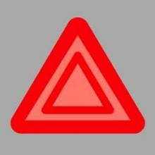
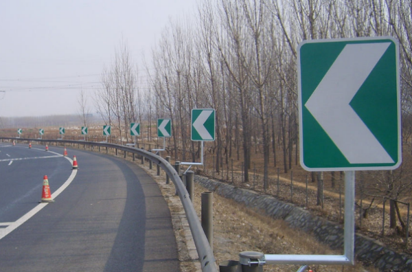
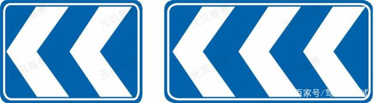

#### 1、口诀
- 假一吊二撤三醉五逃终生。
假一：申领驾照期间提供虚假或伪造信息一年内禁考
吊二：吊销资格后二年不能申请驾照
撤三：撤消资格后三年不能申请驾照
醉五：醉驾后五年不能申请驾照
逃终生：驾车肇事逃逸，终生不能重新申请驾照

- 两证两标一号牌
两证：行驶证、驾驶证
两标：保险标志、检验合格标志
一号牌：车号牌

- 七标:
**(1)警告标志**：警告车辆和行人注意危险地点的标志。
**(2)禁令标志**：禁止或限制车辆、行人交通行为的标志。
**(3)指示标志**：指示车辆、行人行进的标志。
**(4)指路标志**：传递道路方向、地点、距离的标志。
**(5)旅游区标志**：提供旅游景点方向、距离的标志。
**(6)道路施工安全标志**：通告道路施工区通行的标志。
**(7)辅助标志**：附设于主标志下起辅助说明使用的标志。

- 三线：
**(1)指示标线**：指示车行道、行车方向、路面边缘、人行道等设施的标线。
**(2)禁止标线**：告示道路交通的遵行、禁止、限制等特殊规定，车辆驾驶人员及行人需要严格遵守的标线。
**(3)警告标线**：促使车辆驾驶人员及行人了解道路上的特殊情况，提高警觉，准备防范应变措施的标线。

- 驾驶: 无线中间开,无线两边开
- 速度: 无中心线城3公4,有中心线城5公7
- 速度: 转弯、特殊天气、进出非机动车道、铁道路口、窄路窄桥、下坡、掉头: 30公里/小时

- 通行口诀: 右让左,转弯让直行,三叉路口右先行,都是直行,右侧先行

#### 2、常见扣分
- 接电话, **扣2分**

- 普通路逆行,**扣3分**
- 不按规定使用灯光和设置警告标志,**扣3分**

- 违法占用应急车道,**扣6分**
- 违反交通信号灯,**扣6分**
- 不避让校车,**扣6分**
- 驾驶证暂扣期间驾驶机动车,**扣6分**

- 高速逆行, **扣12分**
- 遮挡号牌, **扣12分**
- 饮酒, **扣12分**
- 使用其他行驶证, **扣12分**
- 超速50%, **扣12分**
- 驾驶与准驾车型不符、使用其他机动车号牌, **扣12分**

#### 3、常见时间
- 初次申领驾驶证实习期是**12个月**,还需要在车身后部粘贴统一样式的实习标志。
- 累积积分制度的记分周期是**12个月**。
- 驾驶证有效期 **3个月**内申请更换
- 驾驶证有效期分为**6年 10年 长期**， 初次申领是**6年**
- 70周岁以上驾驶人每**1年**提交一次体检证明
- 实习期内上高速,应该有**3年**以上驾龄人员陪同,否则处200元罚款。
- 因服兵役、出国无法审验驾驶证的,可申请延长期限,最长不超过**3年**,且期间不得驾驶
#### 4、答题技巧
- 什么行为? 直接选违法行为。
- 选项有罚款选罚款，没有就选吊销
- 见到“可以上路”,就选错
- 见到“就”，就选错
- 见到“借”，就选错
- 注意顺序,`首先`.如: 车辆无法移动时,应`首先`开启危险警报灯,而不是`首先`在50-100米处放报警标志。
- 注意顺序,`同时`,如:右转弯同时开启转向灯.应该是提前开启。
#### 5、常见违法行为
- 改装车上道：罚款(200~2000)+吊销机动车驾驶证
- 超速: 超过规定速度的50%, 罚款(200~2000)+吊销机动车驾驶证
- 初次饮酒: 12分,(1000~2000),暂扣6个月驾驶证
- 再次饮酒：10日以下拘留 罚款(1000~2000) 吊销机动车驾驶证
- 驾驶证补领换新,如果还用老的,就要处20～200元罚款。
- 交通肇事罪且负全责的行为: 酒驾、无驾驶资格、车辆有安全隐患、无牌或报废车、严重超载、肇事逃逸。
- 违反交通法规发生重大事故,致人死亡或重伤:
  - 因逃逸死亡: 7年以上
  - 先死亡后逃逸: 3-7年
  - 未逃逸:3年一以下

#### 6、常见速度
- 同向两车道：|100-120| / |60-100|
- 同向三车道：|110-120| / |90-100| / |60-100|
- 同向四车道：|110-120| / |90-120| / |80-100| / |60-80|
- 高速能见度低于200m  限速60 车距大于100m ‘（261 145 520离）
- 急转弯车速不能超过30
- 进出非机动车道 最高速度不能超过30

#### 7、常见操作
- 只要临时停车 就要开启危险报警灯
- 驶入环岛不需要开转向灯,驶出需要开启右转向灯
- 夜间会车,150米外改用近光灯
- 没有交通信号灯的交叉路口和人行横道,交替使用远近光灯示意。
- 驶离高速步骤: 提前开启右转向灯-> 向右进入减速车道-> 降低车速后驶离
#### 8、常识
- 申请驾驶证的年龄18即可,没有上限
- C1: 小型汽车
- C2: 小型自动挡汽车
- C3: 低速载货汽车
- C4: 三轮汽车
- 大型货车年满20周岁可以直接申请
- 危险报警闪光灯按钮
- 潮汐车道双黄虚线
- 心肺按压频率100-120次/分

- 线性诱导标志,该标志用来引导或警告驾驶人改变行驶方向，一般设在有安全隐患的路段。

